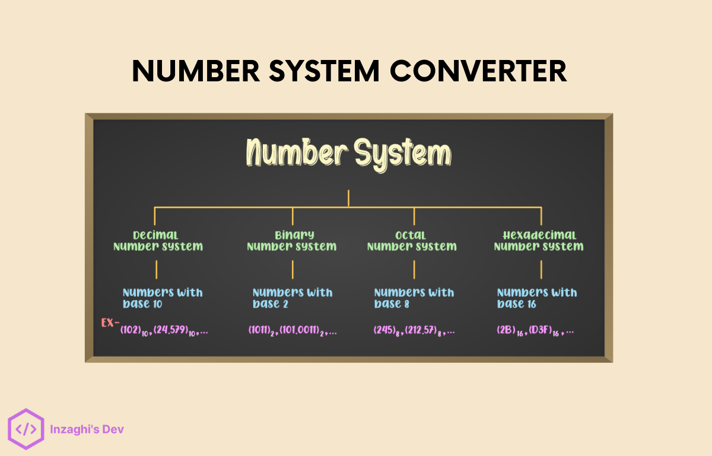
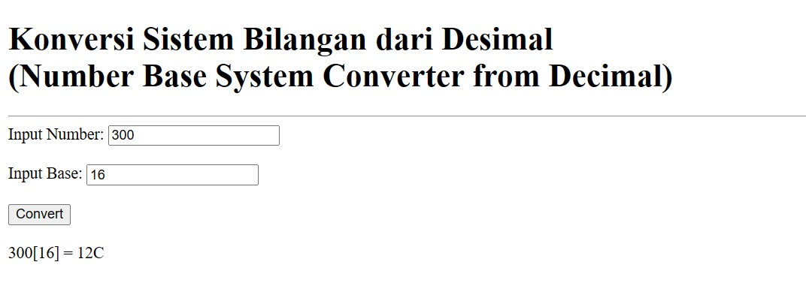
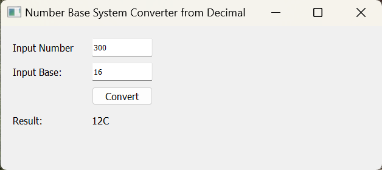
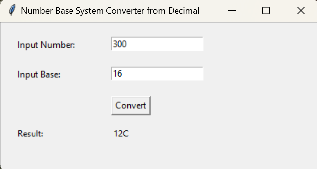

# Number Conversions Program

Merupakan kumpulan Source Code untuk Program Konversi Sistem Bilangan. Dalam Aplikasi ini tersedia dalam berbagai macam Platform seperti Text-based, Aplikasi Web, Aplikasi Desktop, dan Aplikasi Mobile.

## Text-Based Program

Untuk bagian ini, hanya menggunakan Berbasis Teks saja (Text-based). Misalnya, dalam Bahasa C, C++, C#, Java, Python, dll.

Contoh Output :

> Konversi Sistem Bilangan dari Desimal\
> Number Base System Converter from Decimal\
> ===========================================\
> Input Number : 300\
> Input Base : 16\
> 300 [ 16 ] = 12C

## Web-Based App Program

Untuk bagian ini, menggunakan Aplikasi berbasis Web (Web-based) seperti HTML, CSS, JavaScript, dan PHP.

Contoh Output :

## Desktop-Based App Program

Untuk bagian ini, menggunakan Aplikasi berbasis Desktop (Desktop-based) seperti Java GUI dan Python GUI.

Contoh Output :

1. Java GUI

2. Python GUI

PyQt :

Tkinter :

## Mobile-Based App Program

Untuk bagian ini, menggunakan Aplikasi berbasis Seluler/Ponsel (Mobile-based) seperti Java, Kotlin, dan Dart. Aplikasi Mobile di sini menggunakan Aplikasi berbasis Android.

Contoh Output :

[COMING SOON]
